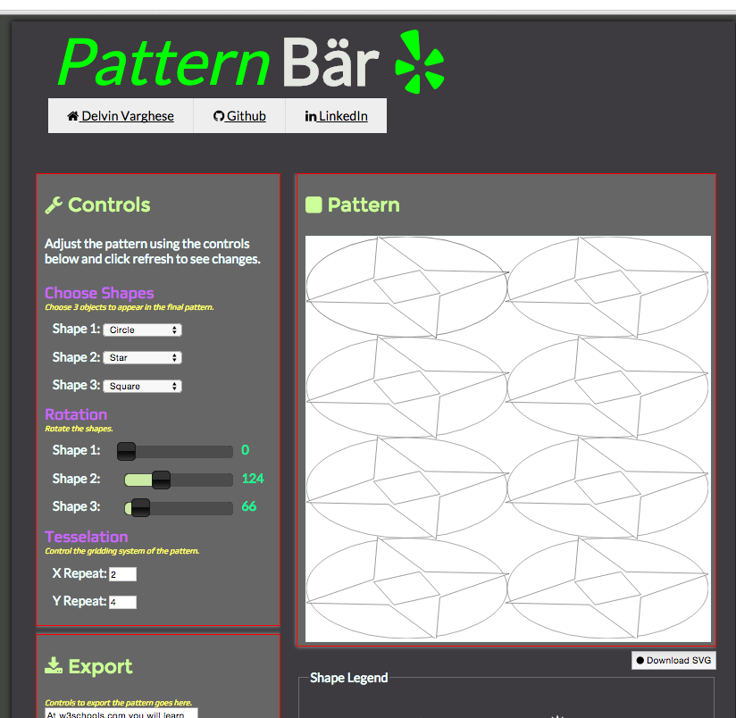

# pattern-bar
A pattern editor to generate SVG patterns that can be exported as JPGs or download as an SVG file.

**Currently being built**

## Functions

- User designs pattern using an interface.
- Patterns can then be exported.

## Source

- Using HTML5, CSS3 and JS
- jQuery and SVG.JS used.
